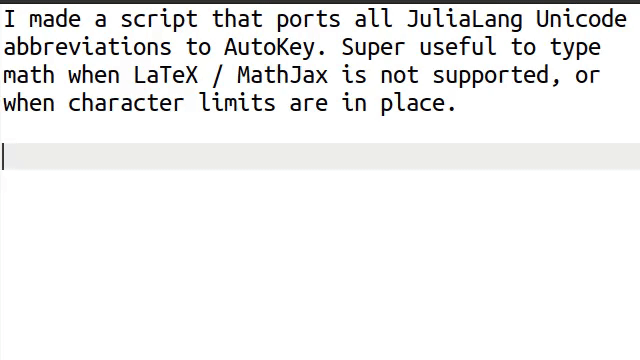

# AutoKey Unicode characters

[Usage](#usage) | [Installation](#installation) | [Changelog](#changelog) | [Features](#features) | [Known Issues](#known-issues--limitations) | [References](#references)

## Usage

This script adds all the Unicode character abbreviations supported by [Julia](https://docs.julialang.org/en/v1/manual/unicode-input/#Unicode-Input) to AutoKey. However, instead of `[TAB]`, they are triggered on `[SPACE]`. If you do not want to perform the replacement, simply hit `[BACKSPACE]` afterwards.

## Installation

1. Install [AutoKey](https://github.com/autokey/autokey). Only works on X11, no Wayland support.
2. Execute `install.py` (requires python ≥3.10)
3. Restart AutoKey

## Features

For overview see [Supported Alphabets](#supported-alphabets)

### Advantages of Unicode

1. Work even when MathJax / LaTeX is not available (e.g. E-mails, chat clients, etc.)
2. Is character efficient (e.g. when writing comments on <https://math.stackexchange.com>)
3. Increases readability of source code.
4. Copy-paste persistent.

### Compatibility with MathJax & LaTeX

1. MathJax supports Unicode characters: `$\sin(\theta)$` and `$\sin(θ)$` should look exactly the same.
2. LaTeX has Unicode compatibility, at least in math-mode when using the [unicode-math](https://github.com/wspr/unicode-math) package and compiling with [LuaLaTeX](http://www.luatex.org/). For usage with `pdflatex`, try the attached `unicode-symbols.sty` package.

⚠️ **BEWARE** ⚠️ If you intend to use <https://overleaf.com>,
this platform only supports the first 65536 Unicode characters
(the "basic plane"). This means that you cannot use any of the characters in the "supplementary planes"
(e.g. the Greek letters 𝛼, 𝛽, 𝛾, …). If you want to use these characters, you need to compile your document locally
([details](https://www.overleaf.com/learn/how-to/What_file_encodings_and_line_endings_should_I_use%3F#Invalid/Unsupported_Characters)).

### Supported Alphabets

To create single characters of the given alphabet, simply type `\<modifier><char><space>`.

- For blackboard bold R, `ℝ`, type `\bbR␣`.
- For a circled one, `①`, type `\o1␣`.
- For a bold italic capital gamma, `𝜞`, type `\biGamma␣`.
- For the sub and superscripts, `Xᵢ²`, type `X\_i␣\^2␣`.
- For the Roman numeral `Ⅷ` (this is a single UTF-8 glyph, and not `V`+`I`+`I`+`I`), type `\RM8␣`.

#### Serif Font

| family | `\bf<>` | `\it<>` | `\bi<>` |
|---|---|---|---|
| Latin | 𝐚𝐛𝐜𝐀𝐁𝐂      | 𝑎𝑏𝑐𝐴𝐵𝐶      | 𝒂𝒃𝒄𝑨𝑩𝑪      |
| Greek | 𝛂𝛃𝛄𝚨𝚩𝚪      | 𝛼𝛽𝛾𝛢𝛣𝛤      | 𝜶𝜷𝜸𝜜𝜝𝜞      |
| Digits | 𝟎𝟏𝟐   | ⸻ | ⸻ |

#### Sans Serif Font

| family | `\sans<>` | `\bsans<>` | `\isans<>` | `\bisans<>` |
|---|---|---|---|---|
| Latin upper | 𝖠𝖡𝖢   | 𝗔𝗕𝗖   | 𝘈𝘉𝘊   | 𝘼𝘽𝘾   |
| Latin lower | 𝖺𝖻𝖼   | 𝗮𝗯𝗰   | 𝘢𝘣𝘤   | 𝙖𝙗𝙘   |
| Greek upper | ⸻ | 𝝖𝝗𝝘   | ⸻ | 𝞐𝞑𝞒   |
| Greek lower | ⸻ | 𝝰𝝱𝝲   | ⸻ | 𝞪𝞫𝞬   |
| Digits | 𝟢𝟣𝟤   | 𝟬𝟭𝟮   | ⸻ | ⸻ |

#### Specialty Font

| family | `\tt<>` | `\bb<>` | `\frak<>` | `\bfrak<>` | `\scr<>` | `\bscr<>` |
|---|---|---|---|---|---|---|
| Latin upper | 𝙰𝙱𝙲   | 𝔸𝔹ℂ  | 𝔄𝔅ℭ  | 𝕬𝕭𝕮   | 𝒜ℬ𝒞  | 𝓐𝓑𝓒   |
| Latin lower | 𝚊𝚋𝚌   | 𝕒𝕓𝕔   | 𝔞𝔟𝔠   | 𝖆𝖇𝖈   | 𝒶𝒷𝒸   | 𝓪𝓫𝓬   |
| Digits | 𝟶𝟷𝟸   | 𝟘𝟙𝟚   | ⸻ | ⸻ | ⸻ | ⸻ |

#### Numerals

| family | `\<>.` | `\rm<>` | `\RM<>` |
|---|---|---|---|
| 0 | ⸻ | ⸻ | ⸻ |
| 1 | ⒈ | ⅰ | Ⅰ |
| 2 | ⒉ | ⅱ | Ⅱ |
| 3 | ⒊ | ⅲ | Ⅲ |

#### Other Families

| family | `\^<>` | `\_<>` | `\o<>` | `\(<>)` | `\sc<>` | `\fw<>` |
|---|---|---|---|---|---|---|
| Latin upper | ᴵᴶᴷ | ⸻ | ⒶⒷⒸ | ⸻ | ᴀʙᴄᴅ | ＡＢＣ |
| Latin lower | ⁱʲᵏ | ᵢⱼₖ | ⓐⓑⓒ | ⒜⒝⒞ | ⸻ | ａｂｃ |
| Greek upper | ⸻ | ⸻ | ⸻ | ⸻ | ⸻ | ⸻ |
| Greek lower | ᵝᵞᵠ | ᵦᵧᵩ | ⸻ | ⸻ | ⸻ | ⸻ |
| Digits | ⁰¹² | ₀₁₂ | ⓪①② | ⑴⑵⑶ | ⸻ | ０１２ |

Note: Generally here not all characters are available:

- Small capital letters is missing `\scX`.
- Sub- and superscripts is missing quite a few letters, see: <https://en.wikipedia.org/wiki/Unicode_subscripts_and_superscripts>.

## Known Issues & Limitations

- When using the `Markdown All in One` extension for VS Code, make sure to disable the `backspace` hotkey, otherwise `AutoKey` will not be able to insert the Unicode characters.
- So far was only tested with Ubuntu 20.04 LTS and `Autokey` 0.95.10
- Seems to behave weird with **Gnome Terminal**, no idea what's going on.
- Can show strange behavior with **VS Code**.
  - Seems fixable by deleting all `[shift]+[insert]` hotkeys combinations. (`File > Preferences > Keyboard Shortcuts`)
  - Our macros here insert symbols with `[shift]+[insert]` and [VS Code seems to mess with that](https://github.com/microsoft/vscode/issues/90637)
- Composed characters seem to not always work as intended, not many editors render them correctly.
- Doesn't support multiple sub/super-scripts like Julia does (e.g. in REPL, `a\^(k)+[TAB]`) gives `a⁽ᵏ⁾`. With `AutoKey` we need to add the superscripts one at a time.
- Seems like it doesn't work with a German keyboard because `AutoKey` interprets `\` and `[AltGr]+?` (what you type on a German keyboard to get backslash) as different things.

## [Changelog](CHANGELOG.md)

- 2024-04-04: Added transpose and hermitian transpose: `A𞁀` and `Aᵸ`. (use `\transpose`/`\hermitian` or provisional `\tp`/`\htp`)
- 2024-04-02: Added missing letter-like symbols
- 2024-03-08: Revamped the installation script, refactored the installation procedure.
- 2024-02-27: Added italic and bold italic Greek variants to `unicode-symbols.sty`.
- 2024-02-26: Combining subscripts: `$xᵢⱼ$` will render identically to `$x_{ij}$` ($x_{ij}$).
- 2024-01-23: **⚠️ New ⚠️:** Added `unicode-symbols.sty` which provides a useful subset of the Unicode characters for usage with `pdflatex`.

## References

- [Unicode Database](https://www.unicode.org/ucd/)
- [Julia Documentation](https://docs.julialang.org/en/v1/manual/unicode-input/#Unicode-Input)
- [AutoKey Documentation](https://autokey.github.io/documentation.html)
- [Latex Symbols](https://ctan.org/pkg/comprehensive)
